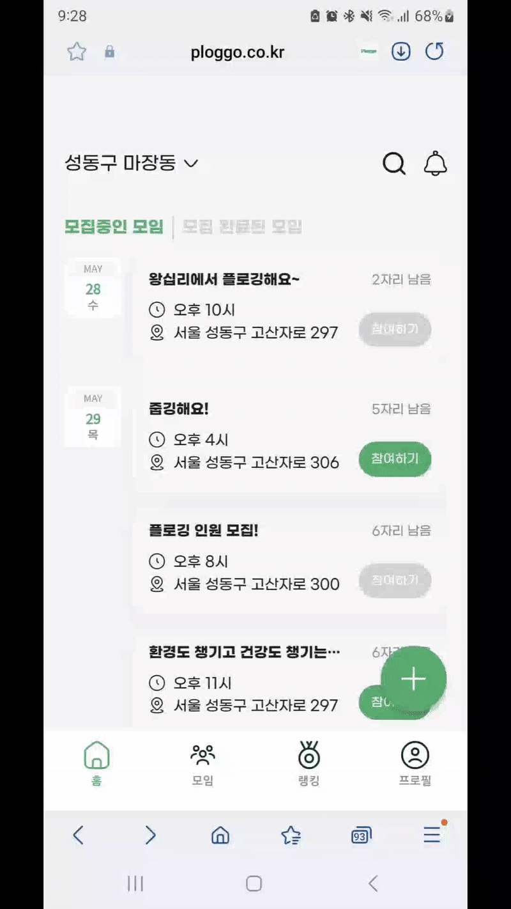

# Ploggo 백엔드 프로젝트

# 소개
여러 사람들과 함께 플로깅을 위해 만들어진 커뮤니티 서비스입니다. 위치 기반으로 현재 위치 주변에 있는 플로깅 모임을 검색하고 참여할 수 있도록 서비스가 구성되어 있습니다.
마친 모임은 기록으로 남겨서 모임 기록을 확인할 수도 있습니다.
이 리포지토리는 프로고 프로젝트의 백엔드 리포지토리입니다.

---

# 시연영상

---
# 기술스택
Java, Spring Framework, JPA, PostgreSQL, PostGIS, QueryDSL, Git, GitHub, GitHub Actions, NCP, Docker, FCM

---
# 주요기능
- 위치, 지역 기반 모임 찾기
- 모임 생성, 참여, 리뷰 기능
- 리뷰 완료한 모임 조회
- 게이미피케이션을 통한 참여 유도
- 어워드(뱃지) 제공
- 소셜 로그인
- 알림 기능

---
# 프로젝트 구조
- 주요 도메인별 패키지 구성
  - 세부 도메인으로 상세구성